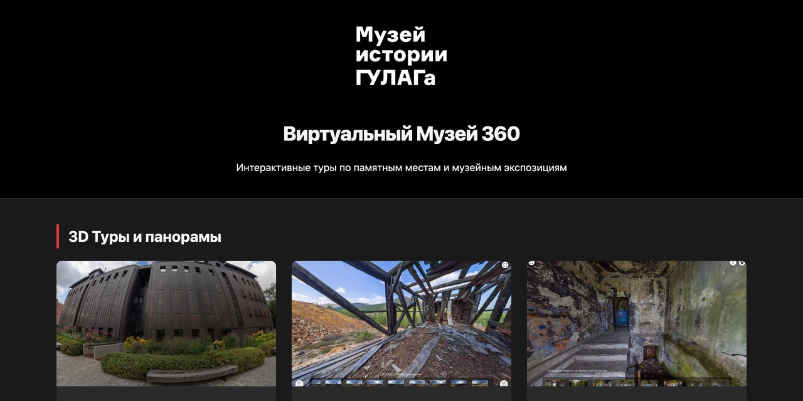

# Виртуальные туры 360°

*360° Virtual Tours*

Каталог панорамных туров и VR-фильмов Музея истории ГУЛАГа: экспозиция музея, лагеря Колымы и Чукотки, выставки.

**[Открыть архив →](https://360.gmig.gulagmemory.org)** · [Все сохранённые сайты](https://gulagmemory.org)

| | |
|:--|:--|
| **Тип** | Каталог виртуальных туров |
| **Годы** | туры 2015–2024 |
| **Адрес архива** | [360.gmig.gulagmemory.org](https://360.gmig.gulagmemory.org) |
| **Снимок сделан** | февраль 2026 · каталог собран при архивации |

## О проекте

Экспедиции музея снимали сохранившиеся лагерные объекты в труднодоступных местах — на Колыме (2014, 2020) и Чукотке (2015), — а в Москве в формате 360° снимались выставки и сам музей. Этот каталог собран при архивации, чтобы свести все туры и VR-видео в одном месте.

| Тур | Что внутри | Репозиторий |
|:--|:--|:--|
| [Постоянная экспозиция](https://expo.360.gmig.gulagmemory.org) | Залы Музея истории ГУЛАГа в Москве | — |
| [Рудник «Днепровский»](https://dneprovsky.360.gmig.gulagmemory.org) | Один из наиболее сохранившихся лагерных объектов на Колыме | — |
| [Штрафной изолятор УСВИТЛа](https://prisonofusvitl.360.gmig.gulagmemory.org) | Здание лагерной тюрьмы в Магадане | [prisonofUSVITL.360.gmig.ru](https://github.com/gulag-museum/prisonofUSVITL.360.gmig.ru) |
| [Чаунлаг](https://chaunlag.360.gmig.gulagmemory.org) | Урановые лагеря «Северный» и «Восточный» на Чукотке | [chaunlag.360.gmig.ru](https://github.com/gulag-museum/chaunlag.360.gmig.ru) |
| [Дело врачей](https://delo-vrachey.360.gmig.gulagmemory.org) | Выставка об одной из последних репрессивных кампаний сталинской эпохи | [delo-vrachey.360.gmig.ru](https://github.com/gulag-museum/delo-vrachey.360.gmig.ru) |
| [Земля 37](https://zemlya-37.360.gmig.gulagmemory.org) | Выставка о местах массовых захоронений Большого террора | [zemlya-37.360.gmig.ru](https://github.com/gulag-museum/zemlya-37.360.gmig.ru) |

**VR-фильмы на YouTube:** [«Дом на Самотёке»](https://www.youtube.com/watch?v=VurNuLEMEuI) — прогулка по зданию музея · [«Магадан, экспедиция 2019»](https://www.youtube.com/watch?v=1zwCDsIXF8Y) — от геологов до лагерей Дальстроя · [«Бывший лагерь „Днепровский“»](https://www.youtube.com/watch?v=cxQ1qRiM-dk) — по руинам лагеря с директором музея.

## Что сохранено

- страница-каталог со ссылками на все туры и видео.

## Что не работает

- туры «Постоянная экспозиция» и «Днепровский» размещены на отдельном сервере, а не на GitHub.

---

Репозиторий входит в [реестр сохранённых сайтов Музея истории ГУЛАГа](https://gulagmemory.org) — некоммерческий архив цифрового наследия, созданный в исследовательских и образовательных целях. Права на тексты, фотографии, видео и другие материалы принадлежат их авторам и правообладателям.

<b>English</b>

### 360° Virtual Tours

Catalogue of the GULAG History Museum's 360° panoramic tours and VR films: the museum's permanent exhibition, the Dneprovsky mine in Kolyma, the USVITL punishment block in Magadan, Chaunlag uranium camps in Chukotka, and the Doctors' Plot and Earth 37 exhibitions.

**Type:** Virtual tour catalogue · **Archive:** [360.gmig.gulagmemory.org](https://360.gmig.gulagmemory.org)

Part of the [registry of preserved GULAG History Museum websites](https://gulagmemory.org) — a non-commercial digital heritage archive for research and education. All texts, photographs, video and other materials remain the property of their authors and rights holders.

